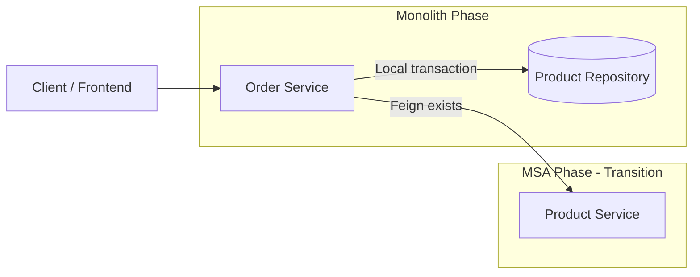

# Limited Store

> 이 프로젝트는 “완성된 MSA 구현”이 아니라,  
> MSA로 전환하기 전 단계에서 **어떤 책임을 먼저 분리해야 하는지**,  
> 그리고 **통신 실패를 어떻게 비즈니스 실패로 해석해야 하는지**를  
> 코드와 테스트로 설명하는 **설계 중심 백엔드 프로젝트**입니다.

---

## 프로젝트 개요
Limited Store는 한정 수량 상품 주문 시 발생하는 **책임 분리, 정합성, 트랜잭션 경계 문제**를 실험하기 위한 개인 백엔드 프로젝트입니다.  
모놀리식 구조로 CRUD와 비즈니스 로직을 구현한 뒤,  
테스트와 구조 이해를 중심으로 **Order ↔ Product 영역만 최소 수준으로 분리하는 과도기적 MSA 구조**를 설계했습니다.

본 프로젝트의 목적은 **완성된 MSA가 아니라**,  
**서비스 분리 기준과 실패 판단을 코드와 테스트로 설명하는 것**입니다.

---

## 기술 스택
- Java 17  
- Spring Boot 3.3.5  
- Spring Data JPA  
- Spring Security + JWT  
- JUnit5 / Mockito  
- Spring MVC Test  
- Spring Cloud OpenFeign  
- Swagger (springdoc)

---

## 설계 목표

### Out of Scope
- 완전한 MSA 아키텍처
- API Gateway / Service Discovery / Circuit Breaker
- Saga / 분산 트랜잭션

### In Scope
- 서비스 분리 기준을 설명할 수 있는 구조 설계
- Order ↔ Product 간 책임 경계 명확화
- 통신 실패 시 비즈니스 실패 판단 기준 정의
- 확장 가능한 과도기 구조 유지

---

## 테스트 전략
본 프로젝트에서는 **계층별 책임을 검증하는 테스트 구조**를 사용합니다.

### Service Test — “시스템이 언제 실패해야 하는가”
- 비즈니스 규칙 및 도메인 로직 검증
- Repository 및 외부 통신(Feign Client) Mockito Mock 처리
- **주요 검증 항목**
  - 상품 미존재
  - 재고 부족
  - 중복 주문
  - 정상 주문 생성
  - 주문 취소

Service Test는  
**시스템이 어떤 조건에서 성공하거나 실패해야 하는지**를 검증하는 계층입니다.

### Controller Test — “실패를 어떻게 외부에 표현하는가”
- Spring MVC 관점에서 요청/응답 흐름 검증
- `@WebMvcTest` 기반으로 Controller 계층만 로딩
- Service는 `@MockitoBean`으로 대체
- JWT 인증은 통과되었다고 가정하고  
  `requestAttr("memberId")`로 인증 정보 주입
- `GlobalExceptionHandler`를 통해  
  HTTP 상태 코드 및 공통 응답 포맷 변환 여부 검증

Controller Test는  
**시스템 내부 실패가 외부 API 계약으로 어떻게 표현되는지**를 검증합니다.

---

## MSA Transition Structure (Order ↔ Product)
아래 구조는 모놀리식에서 MSA로 전환하는 **과도기적 설계 상태**를 나타냅니다.  
현재는 **상품 존재 여부만 Product 서비스로 분리**하고,  
**재고 확인 및 차감은 로컬 트랜잭션으로 유지**하고 있습니다.



---

## Failure Flow (실패 흐름 매핑)

### Product 미존재 → 주문 생성 이전 실패
- **Code**: `OrderService#createOrder()` → `productClient.exists(productId)`
- **Action**: `throw CustomException(PRODUCT_NOT_FOUND)`

### Product 통신 실패 → 주문 생성 이전 실패
- **Code**: `OrderService#createOrder()` → `productClient.exists(productId)`
- **Design**: Feign 호출 예외 (`FeignException`, `RetryableException`)는  
  Product 상태를 신뢰할 수 없는 상태로 간주하여 **비즈니스 실패로 처리**

### 재고 부족 → 주문 생성 이전 실패
- **Code**: `OrderService#createOrder()` → 재고 검증
- **Action**: `throw CustomException(OUT_OF_STOCK)`

### 재고 차감 / 저장 실패 → 전체 트랜잭션 롤백
- **Code**: `OrderService#createOrder()` → `product.decreaseStock()` → `productRepository.save(product)`
- **Design**: Spring 트랜잭션 경계 내 영속성 예외 발생 시  
  주문 생성과 재고 변경을 **하나의 원자적 작업으로 롤백**

---

## 트랜잭션 경계 (One-Line Rule)
주문 생성은  
**상품 존재 확인 → 재고 확인 → 주문 생성 → 재고 차감**  
을 하나의 성공 단위로 묶으며,  
Product 상태를 신뢰할 수 없는 경우 **전체 트랜잭션을 실패**시킵니다.

---
## How to Run


### Requirements
- Java 17
- (Optional) Docker
- PostgreSQL or H2

### Run
```bash
./gradlew test
./gradlew bootRun
```

### API Docs
http://localhost:8080/swagger-ui.html

---


## Project Positioning
이 프로젝트는 “완성된 MSA 구현”이 아니라,  
**MSA로 전환하기 전 단계에서 어떤 책임을 먼저 분리해야 하는지,  
그리고 통신 실패를 어떻게 비즈니스 실패로 해석해야 하는지를  
코드와 테스트로 설명하는 설계 중심 프로젝트입니다.**

---

## Next Step (Planned)
- 재고 API 분리 (Product → Inventory Service)
- 서비스 간 실패 정책 명문화 (Timeout / Fallback 전략)
- 통합 테스트 기반 서비스 경계 검증


  
